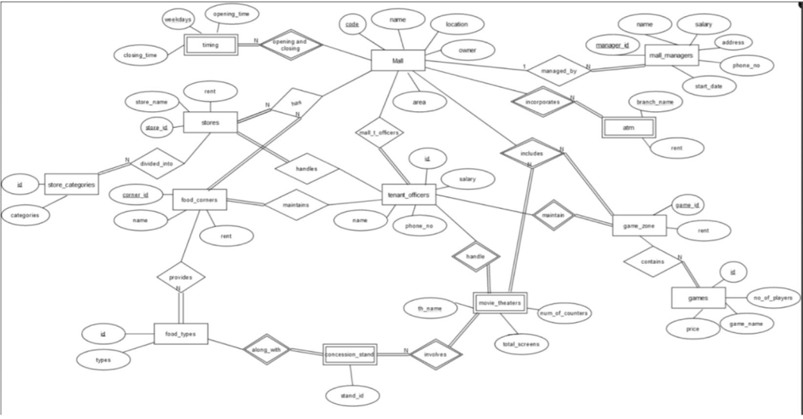
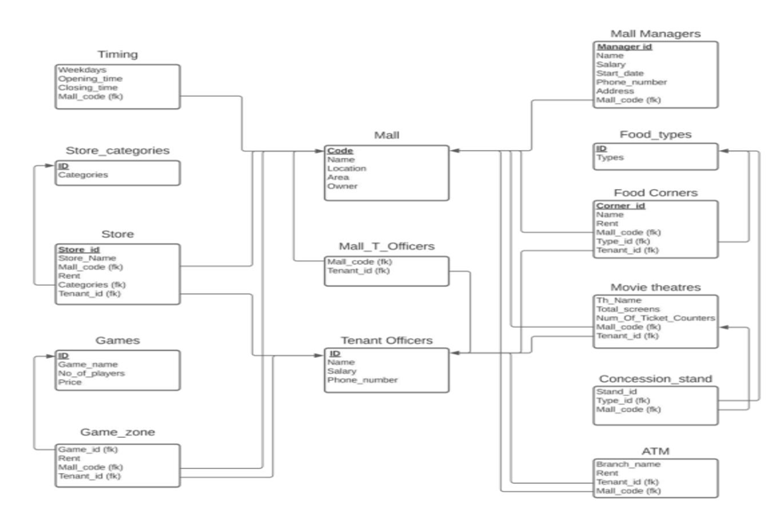

# Mall Management Database System

## Problem Statement
The Mall Management Database System is designed to provide a structured and scalable approach to managing various entities in a shopping mall ecosystem. Traditional mall databases focus only on tenant and store listings. This project goes beyond by incorporating the relationships between malls, stores, categories, movie theatres, food corners, and tenant officers, along with the managerial structure.

The goal is to offer a normalized and query-efficient schema that enables mall administrators to:
- Track store categories
- Manage tenant officer responsibilities
- Link stores to specific malls
- Enable insights into managerial roles and their impact
- Support future extensions like analytics and real-time dashboards

---

## Overview
This database project simulates the backend infrastructure for managing malls and their components effectively. It includes granular details about malls, store categories, tenant officers, food courts, and movie theatres. The system can help improve operational efficiency and managerial oversight through structured queries and relations.

---

## Key Features

### Mall and Store Management
- Each mall is assigned a unique mall code.
- Stores are associated with malls and categorized by store type (e.g., clothing, electronics, etc.)

### Tenant Officers
- Officers manage both food corners and movie theatres.
- A single officer can work in multiple roles (food and entertainment).
- Officer details are stored and linked via foreign keys.

### Movie Theatres and Food Corners
- Movie theatres are tied to both malls and officers.
- Food corners are similarly mapped, offering detailed traceability.

### Mall Managers
- Each mall has a manager, and the database allows you to find:
  - Who manages which mall
  - How many stores each manager oversees

### Query-Driven Insights
- Retrieve comprehensive details about:
  - Malls and their associated officers
  - Categories of stores in specific malls
  - Officers involved in both food and entertainment
  - Store count managed per mall manager

---

## Database Structure

### Tables Included:

- **MALL**: Stores details of malls.
- **STORES**: Contains information about individual stores.
- **STORE_CATEGORIES**: Links each store to a predefined category.
- **TENANT_OFFICERS**: Maintains officer information who oversee food courts and theatres.
- **MOVIE_THEATRES**: Holds data about theatres and their associated tenant officers and malls.
- **FOOD_CORNERS**: Captures food stall info and responsible tenant officers.
- **MALL_MANAGERS**: Maintains the managerial structure of each mall.

---

## Tools and Technologies 

- **Database** : Oracle SQL
- **Tools**    : SQL Developer

## Schema

  

## About

This repository contains the source files for the **Mall Management Database System**, built as part of the **CS254 - Database Management Systems** coursework.

### Contact

Feel free to reach out to me via:

- Email: bharadwajnitw@gmail.com  
- GitHub: [@Bharadwaj721](https://github.com/Bharadwaj721)

I'd be happy to discuss, collaborate, or just hear your thoughts!

## License

This project is licensed under the **MIT License** — see the `LICENSE` file for full details.
